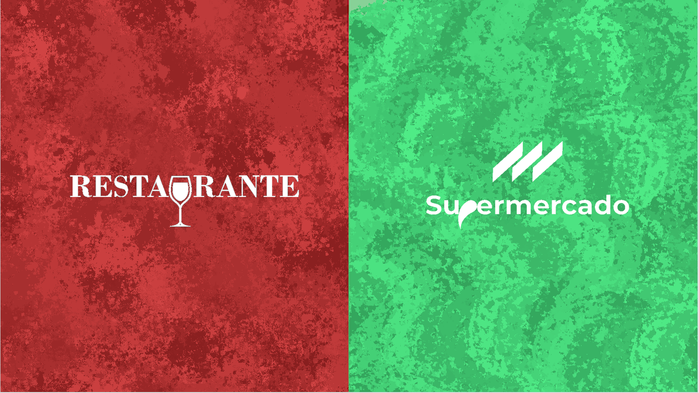
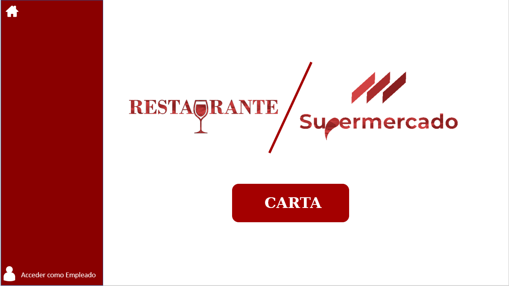
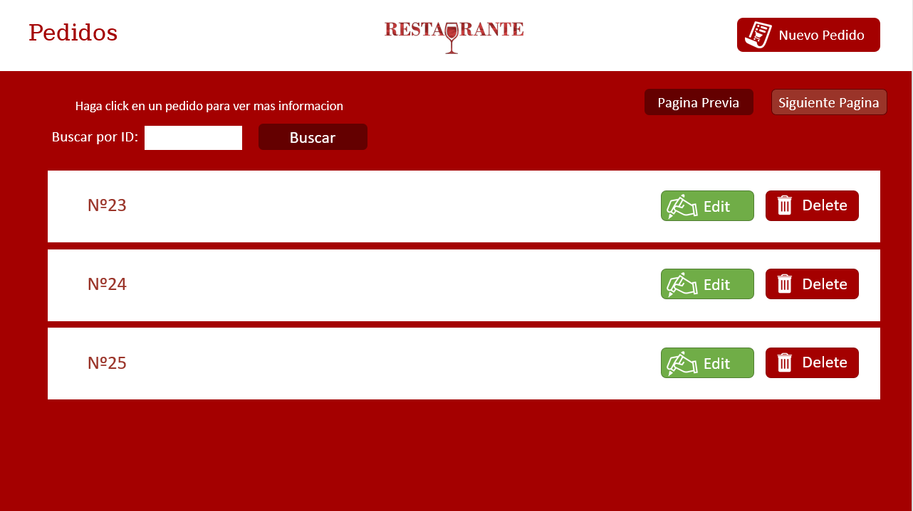

<h1 align="center">
   
  
</h1>

# Restaurante

Restaurante es una aplicación de escritorio para controlar un restaurante basado en pedidos, los cuales contienen platos y cada uno de éstos es atendido por el personal del restaurante.

## Información

La aplicación Restaurante es una copia del proyecto realizado en la asignatura **Modelado del Software (MS)** en la **Universidad Complutense de Madrid (UCM)**.
El proyecto fue realizado por un equipo de 12 personas, organizadas en grupos de 4 y dentro de cada grupo por parejas.
Para la implementación de la aplicación se empleó IBM RSAD.

El programa desarrollado es un software de gestión de auto compra de supermercados y de restaurante.
Como el proyecto de supermercado está explicado en otro repositorio, éste se va a centrar más en hablar de la extensión.

<a href="https://github.com/CGLMaster/Supermercado.git">Repositorio supermercado</a>

A través de este software se quiere proporcionar al cliente una forma para gestionar sus pedidos al restaurante de manera automática, en la que los datos se guardarán en una BD que contendrá la información de los clientes, sus pedidos, los platos que tendrá éste, con sus ingredientes específicos y además al personal que se le asigne dicho pedido, los turnos que tienen estos empleados.

Donde se almacenaban todos los objetos declarados era en una base de datos MySQL pública la cual por problemas económicos ya no existe.

## Interfaces

Al no tener un vídeo en el que se ve su funcionamiento, solo puedo otorgar capturas de algunas interfaces que conformaban el proyecto

Esta sería la interfaz principal, la cual nada más abrir la aplicación te saldría.
  
Esta interfaz te permite elegir entre entrar en la aplicación de supermercado o la de restaurante.

En caso de que se seleccione restaurante ésta sería su interfaz principal:

En caso de que seas un cliente darías a Carta y te llevaría a la interfaz de la carta en la cual elegirías los platos que quieres junto a su cantidad, realizaría la validación y pagarías la cuenta.

En el caso de que seas un empleado del restaurante, te registrarías con el botón de la esquina inferior izquierda. Una vez registrado se desplegará en el lateral izquierdo un navbar con las distintas secciones a las cuales podrás acceder y realizar modificaciones, añadir, y eliminar. Un ejemplo de una de éstas interfaces sería la siguiente:

Como se puede observar en la imagen ésta esta compuesta por una cabecera en la cual está el logo de la aplicación (pulsándolo te lleva a la pestalla de inicio) y a su derecha el botón para añadir un pedido. Al pulsar a dicho botón aparecería un modal en el cuál tendrías que especificar toda la información para añadirlo.

Debajo de ésta cabecera aparece una lista de los pedidos de los que se dispone, con un sistema de paginación. Se puede buscar un pedido en concreto con el buscador de arriba.

Por cada pedido de la lista aparece su nombre, haciendo click sobre él mostrará un modal con su información. También dispone de un botón para modificar el pedido o eliminarlo.

## Propietario
* **Luis** Enrique Barrero Peña
* **José Luis** Bartha de las Peñas
* **Bryan Eduardo** Córdova Ascurra
* **Carlos** Forriol Molina
* **Pablo** Gamo González
* **Carlos** Gómez López
* **Mario** González de Santos
* **Javier** de Hoyos Pino
* **Rubén** Martín Castro
* **Alberto Alejandro** Rivas Fernández
* **Juan** Romo Iribarren
* **Gabriel** Torres Martín
